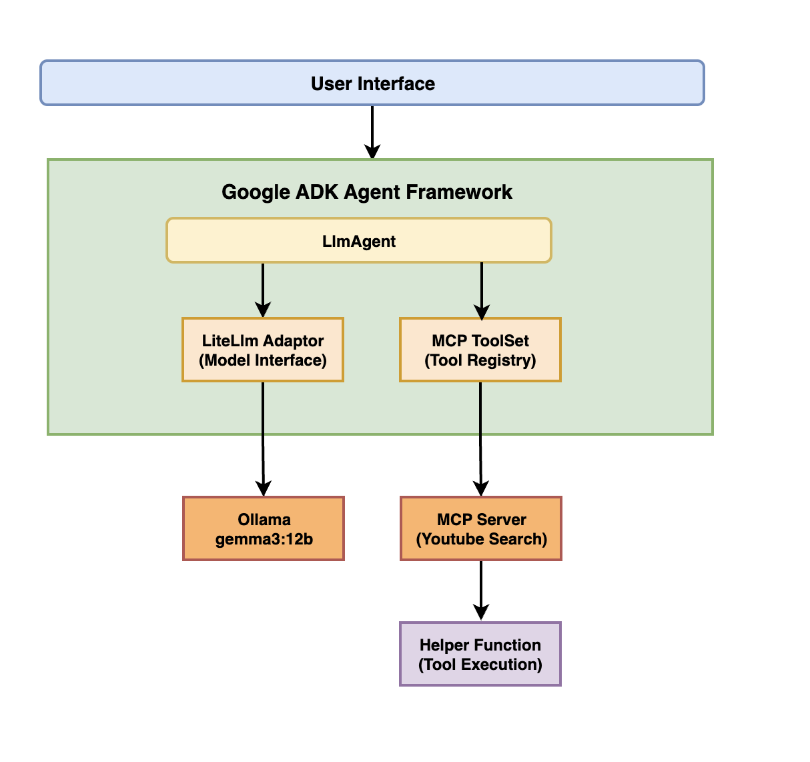
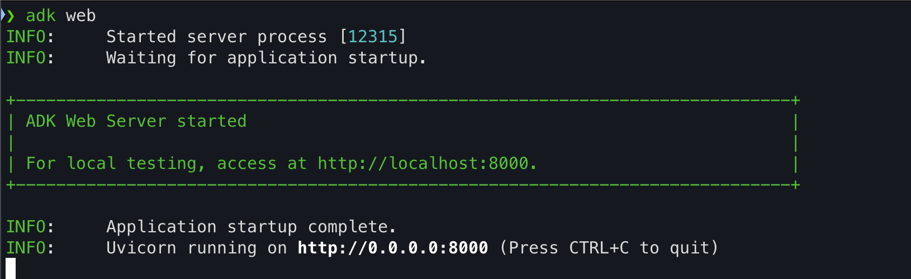

# YouTube Search Assistant with ADK, MCP and Gemma 3

A practical implementation demonstrating YouTube search functionality using Google's Agent Development Kit (ADK), Model Context Protocol (MCP), and the Gemma 3 model via Ollama.


## 📚 Table of Contents

* [🔍 Introduction](#-introduction)
* [🏗️ Architecture](#-architecture)
  * [🧩 Core Components](#-core-components)
  * [📊 Architecture Diagram](#-architecture-diagram)
  * [🔄 Data Flow](#-data-flow)
  * [✨ Technology Highlights](#-technology-highlights)
* [🚀 Features](#-features)
* [🧠 Core Concepts](#-core-concepts)
  * [ADK - Agent Development Kit](#adk---agent-development-kit)
  * [MCP - Model Context Protocol](#mcp---model-context-protocol)
  * [Agents in ADK](#agents-in-adk)
  * [Tools with MCP](#tools-with-mcp)
  * [Ollama Integration](#ollama-integration)
* [📋 Requirements](#-requirements)
* [🚦 Getting Started](#-getting-started)
  * [1. Installation Steps](#1-installation-steps)
  * [2. Setup](#2-setup)
  * [3. Usage](#3-usage)
* [🔄 How It Works](#-how-it-works)
* [📁 Project Structure](#-project-structure)
* [⚠️ Troubleshooting](#-troubleshooting)
* [📦 Repository](#-repository)
* [👨‍💻 Author](#-author)
* [📄 License](#-license)

## 🔍 Introduction

This project showcases how to leverage Google's ADK (Agent Development Kit) and MCP (Model Context Protocol) to build an agent powered by Gemma 3, Google's latest large language model. It demonstrates how to:

* Connect to locally-hosted Gemma 3 via Ollama
* Implement YouTube search functionality using MCP
* Create a conversational agent that can format and present search results

## 🏗️ Architecture

### 🧩 Core Components

* **Google ADK** - Provides the agent framework
* **Model Context Protocol (MCP)** - Standardizes tool communication
* **Gemma 3 (12B)** - Powers the language understanding and generation
* **Ollama** - Hosts the Gemma model locally
* **MCP YouTube Search** - Provides YouTube search capabilities
* **Python 3.9+** - Base runtime environment

### 📊 Architecture Diagram



### 🔄 Data Flow

1. User submits a query through the interface
2. ADK Agent Framework processes the query and determines intent
3. If a YouTube search is needed:
   - The request is routed to the MCP Tool Registry
   - The MCP YouTube Search tool receives the query
   - SERP API is called to fetch YouTube results
   - Results are returned through the MCP standardized format
4. Gemma 3 model (via Ollama and LiteLlm):
   - Receives the search results
   - Generates a natural language response
   - Formats the search results into readable bullet points
5. The formatted response is returned to the user interface

### ✨ Technology Highlights

* **Google ADK**  
  Manages conversation flow and tool orchestration.
* **Model Context Protocol (MCP)**  
  Enables standardized communication between models and tools.
* **Gemma 3 via Ollama**  
  Delivers high-quality text generation with tool-calling capabilities.
* **LiteLlm Integration**  
  Connects ADK to Ollama-hosted models seamlessly.
* **SERP API**  
  Provides access to YouTube data through search API.

## 🚀 Features

* 🔍 Search for YouTube videos using natural language queries
* 🤖 Powered by Gemma 3 running on Ollama
* 📋 Formats search results in a clean, easy-to-read format
* 🛠️ Built with Google's Agent Development Kit (ADK)
* 🔄 Integrates MCP (Model Context Protocol) for seamless tool communication

## 🧠 Core Concepts

### ADK - Agent Development Kit

**Agent Development Kit (ADK)** is an open-source, code-first Python toolkit for building intelligent AI agents. It provides the infrastructure needed to create agents that can interact with users, reason about tasks, and use tools to complete goals.

### MCP - Model Context Protocol

**Model Context Protocol (MCP)** is a standard for communication between models and tools. It allows for:
* Consistent tool invocation patterns
* Structured data exchange
* Tool composition and chaining
* Language-agnostic tool definitions

### Agents in ADK

An **Agent** in ADK acts as the orchestrator for AI interactions. In this project, we use **LlmAgent**, which is a core component in ADK acting as the "thinking" part of your application that:

* Leverages a Large Language Model (LLM) for reasoning and understanding
* Manages conversation history and context
* Coordinates tool usage based on user queries

### Tools with MCP

Tools in this project are implemented using the **MCP (Model Context Protocol)** framework, which:
* Defines a standard interface for tool interaction
* Makes tools easily discoverable by the LLM
* Structures input/output formats
* Facilitates tool composition

The MCP YouTube Search tool provides a standardized way for the agent to interact with YouTube search functionality.

### Ollama Integration

**Ollama** provides a way to run Gemma 3 and other large language models locally. Google ADK connects to Ollama through:

* **LiteLlm** - A wrapper that standardizes communication with different LLM providers
* Custom configurations to optimize model performance

## 📋 Requirements

* Python 3.9+
* [Ollama](https://ollama.ai/) installed with Gemma 3 model
* A SERP API key for YouTube search

## 🚦 Getting Started

### 1. Installation Steps

Clone this repository:
```bash
git clone <your-gitlab-repo-url>
cd <your-project-directory>
```

### 2. Setup

#### Create and activate a virtual environment:
```bash
python -m venv .venv
source .venv/bin/activate  # On Windows: .venv\Scripts\activate
```

#### Install dependencies:
```bash
pip install -r requirements.txt
```

#### Set up your SERP API key:
Create a `.env` file in the root directory with your SERP API key:
```
SERP_API_KEY=your_serp_api_key_here
```

#### Pull the Gemma 3 model:
```bash
ollama pull gemma3:12b
```

### 3. Usage

#### Option 1: Web-based UI (Recommended for debugging)

Run the agent using ADK's browser-based developer UI:
```bash
# Navigate to the parent directory
cd <your-project-directory>

# Start the web interface
adk web
```

You should see output similar to this:



Then open the URL provided (usually `http://localhost:8000`) in your browser.
* Select "search" from the dropdown menu in the top-left corner
* Type your query in the chat interface
* You can inspect tool calls, model responses, and see detailed execution flow

#### Option 2: Command Line

Run the agent directly:
```bash
python -m search
```

You can now interact with the agent by asking it to find YouTube videos.
   
Example queries:
- "Find videos about Google Cloud Next 25"
- "Search for YouTube tutorials on Python programming"
- "Look for videos about machine learning for beginners"

## 🔄 How It Works

The implementation follows these steps:

1. **Agent Initialization**:
   * Creates an LlmAgent with a reference to the Ollama-hosted Gemma 3 model
   * Configures the agent with appropriate instructions
   * Adds the YouTube search tool to the agent's capabilities

2. **Tool Definition**:
   * Defines a YouTube search function through MCP
   * MCP provides a standardized way for the model to interact with the tool
   * The tool connects to SERP API for YouTube search functionality

3. **Query Processing**:
   * User query is passed to the agent
   * Gemma 3 decides whether to use the YouTube search tool based on the query
   * If needed, the model formulates an appropriate search query
   * Results are processed and formatted by the model

4. **Response Generation**:
   * The agent processes all information and formats the search results
   * Output is returned to the user as a clean, bulleted list
   * Each result includes title, link, channel, description, and metadata

## 📁 Project Structure

```
adk_mcp_gemma3/
├── Images/
│   ├── adk-gemma3.gif           # Demo gif of the application
│   └── adk-gemma-web.gif        # Web interface demo
├── search/
│   ├── __init__.py              # Package initialization
│   └── agent.py                 # Agent implementation with ADK
├── .gitignore                   # Git ignore file
├── README.md                    # Project documentation
├── LICENSE                      # MIT license
└── requirements.txt             # Dependencies
```

## ⚠️ Troubleshooting

1. **Model Loading Issues**:
   * Ensure Ollama is running: `ollama list` should show the gemma3:12b model.
   * If the model fails to load, try: `ollama pull gemma3:12b` again.

2. **API Key Issues**:
   * Verify your SERP API key is correctly set in the .env file.
   * Test the API key independently to ensure it's valid.

3. **Memory Constraints**:
   * The 12B model requires significant RAM/VRAM.
   * Consider using a smaller model like gemma3:7b if experiencing memory issues.

4. **Function Calling Problems**:
   * If the model doesn't use tools properly, try making the tool description more explicit.
   * Ensure your query clearly requires external information.

5. **LiteLLM/Ollama KeyError Bug**:
   * There's a known issue with Ollama's JSON format responses and LiteLLM's parsing that can cause a KeyError: 'name' error.
   * This happens when Ollama returns JSON format that isn't specifically a tool call format.
   * Error looks like: `KeyError: 'name'` in `litellm/llms/ollama/completion/transformation.py`
   * A fix has been submitted in PR #9966 for the LiteLLM package but is still pending approval and merging.
   * This bug might cause your application to crash or enter an infinite loop when using function calling with Ollama models.
   * **Temporary workarounds**:
        * Manually patch your local LiteLLM installation with the changes from PR #9966
        * Avoid using `format=json` in Ollama requests if possible
        * Wait for the PR to be merged and update to the next LiteLLM release that includes the fix

## 📦 Repository

This project is available on GitHub at [arjunprabhulal/adk-mcp-gemma3](https://github.com/arjunprabhulal/adk-mcp-gemma3).

For another related project on ADK with function calling, check out [arjunprabhulal/adk-gemma3-function-calling](https://github.com/arjunprabhulal/adk-gemma3-function-calling).

## 👨‍💻 Author

Created by Arjun Prabhulal. For more articles on AI/ML and Generative AI, follow [Arjun Prabhulal on Medium](https://medium.com/@arjun-prabhulal).

## 📄 License

This project is released under a free and open license. Anyone is free to use, modify, distribute, or build upon this code for any purpose, including commercial applications, without restriction. 